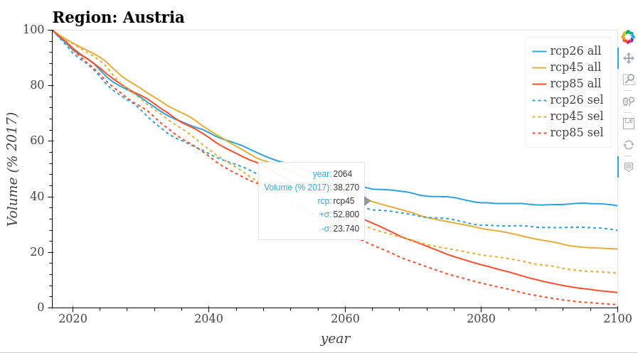

.. _future-alps:

Future evolution of glaciers in the European Alps
=================================================

Find out about the future evolution of glaciers in the European Alps! The graphic presents the volume change of the glaciers under three different `RCP-scenarios <https://www.skepticalscience.com/rcp.php>`_. In addition, the glacier evolution of the different alpine countries can be compared.

- to start the app click on this link: |badgelink|_

.. |badgelink| image::  https://img.shields.io/badge/launch-bokeh%20app-579ACA.svg?style=popout&logo=     data:image/png;base64,iVBORw0KGgoAAAANSUhEUgAAACAAAAAgCAYAAABzenr0AAAABmJLR0QA/wD/AP+gvaeTAAAACXBIWXMAAC4jAAAuIwF4pT92AAAAB3RJTUUH4wEeDC0U4ki9ZgAAABl0RVh0Q29tbWVudABDcmVhdGVkIHdpdGggR0lNUFeBDhcAAAQFSURBVFjD7ZddaBxVGIafc2Y22+1u0qSxyaZJbBMTxLapUseUIsWWWrRIFhYL9bfgjdirQgX1qhUUb7zwQnqhghZ7IYo4MKJoo1YUtcQxlTRpWkyWGEp+l+zmZ5vs7swcL9yENeruxhi9yXc358z5nvfM9853ZgT/X/gAyXqsx3r8W2FHI9jRyNpDll1X2dFIVbH7CoVYCdgwLexoZA/wDHA34M/lSAE9wNuGaX2/fM2qBCyDnwFOCKU2S9fxCaUAUEKgpHQ8qc0BJvC8YVqTpYjQS3kCOfgrwEnheRvnqrYwuHMv09V1eEISnE2wdahfDw9fr9SczFNKyDvsaOSYYVrDxcohiu0+Bz8CnBeeVz1y2y6utD+AEmIpgRDgIqkeH2aH/QWhZBwl5SfAE4ZpJRfzrMYDF4XnHUjUNtJ16BgqN66UIlxVjtFSzzd9Q0ylXcKjMXb+2MnG2SRKiCeB9wzTcv8utywBbgBNUnn07zmIAny6JBTwo3DZFMpyZ3MYo7Uezc0y1thKvK4JT2oAJ4CyQvlLOQ7bhPJCc5XVpCo2A3BPawOHdjdzIxHj3LdnSaQSNIcrqa0MQNYhXredrD8ASrUX81kpAiqFUr754CZQCp8uOdDWREt9JRv8ccaTE3THekllphhJ/oLrZkgHQniatmhyXyEjliIgpRBuWXoeIXXiswN0DXTj18t45N7DzMyn+CnWw+R0nK7YV8RTN/C5DsLzFterQslLeQ17lBSp8mS8SkyPcmHwQ77sf58zR0/RUL0Vv17G11d/YDw5yeDENbRAI/uSG9CzGRBiCEivqg8YpnXJjkauStdtaLjcyUJgBkcpXvroNVrDzWRdh9j4rwyMDZERkBnto2LMh8/J4sEHgPOPPbBUOyFedGGiZXyC44kgITTG5mf4bqAbD3AFpHVBrSrjyMgs4dk5FGoGOA9kCjG0EpqQnPn5cnzLQx1pJx4/uH1earendSrQUJpECMEtjmTfTT8PJwPctVCGD4GCU8Dnhml5djTCm9eul16CZa49Wb6r7bi/pubizWDwsDY9/fKOBX3/toxGSvrJCtAUBD1ByBMACwpeAM4ZpuUUOwtEkd13AK8D24TuQ7nOgyhlA3sFPAbsB27NOT2m4GPgXeDKIrxQG/5LAXnw3cBbQHtuqhe4zzCtKTsakbnvej3PRx6QBbKGaalS4H8SkAevAc4CR3NTidxu+4olXMm3wJKAfKV2NBIATvN7HRcbSQfwqWFaqpRdrSTkMuUSeDwPDvAscGEt4AAy77EL4H7g1bz5N4B3DNPKrgX8Dx6wo5Fm4DOgNTfUCTxtmNbQWsGXSpAzTSivL/QCp9caDqDnAXrsaORR4DnAMkzr0n/xP/Ebgv/Oed8KI9UAAAAASUVORK5CYII=
.. _badgelink: alps_future-app.html

Authors
-------

`Fabien Maussion <https://fabienmaussion.info/>`_ and `Zora Schirmeister <https://github.com/zschirmeister>`_

Data sources
------------

Data: `Zekollari et al. (2019) <https://www.the-cryosphere.net/13/1125/2019/>`_

Source code
-----------

Code and data are on `GitHub <https://github.com/OGGM/alps_future>`_, BSD3 licensed.

Possible future improvements
----------------------------

- implementation of uncertainties into the graphic
- possibility to choose between absolute and percentage change of volume
- adding a map in which the user can select glaciers
- implement tick-boxes for choosing the displayed RCP-scenarios
- two dropdown menus to give the opportunity that every region can be compared to every other region/country

If you are interested to contribute you can send us the edited `file <https://github.com/OGGM/alps_future/blob/master/app.ipynb>`_ per mail or with a pull-request. Thanks!
