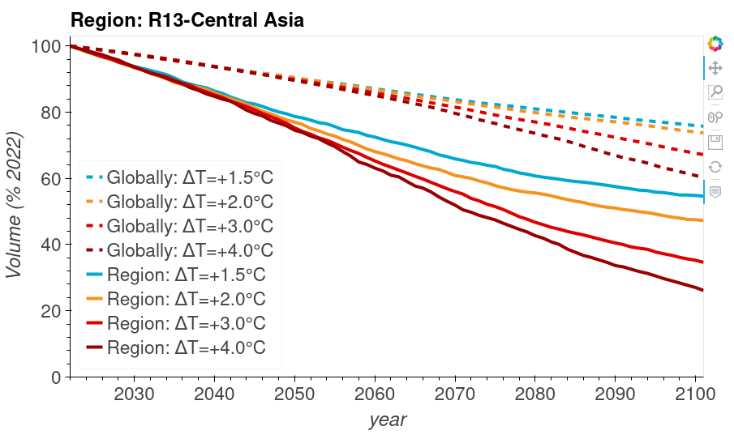

.. _future-alps:

Future evolution of glaciers
=============================

Globally or regionally:
-----------------------

Find out about the global future evolution of glaciers! This
interactive graphic displays the volume change of all glaciers worldwide under
four different global warming scenarios between +1.5°C and +4°C until 2100. You can also compare
the global evolution to single glacier regions. 

To start the app, click on this link: |badge_bokeh_en|_

.. _badge_bokeh_en: global_future_glacier-app_rounce_delta_T_en.html
.. _badge_bokeh_de: global_future_glacier-app_rounce_delta_T_de.html

European Alps:
--------------

You can also only look at the evolution of glaciers in the European Alps and compare 
the different alpine countries

To start the app, click on this link: |badge_bokeh_en_alps|_

.. _badge_bokeh_en_alps: alps_future-app_rounce_delta_T_en.html
.. _badge_bokeh_de_alps: alps_future-app_rounce_delta_T_de.html

Authors
-------

`Fabien Maussion <https://fabienmaussion.info/>`_, `Zora Schirmeister <https://github.com/zschirmeister>`_ and `Lilian Schuster <https://github.com/lilianschuster>`_

Data sources
------------

Data: `Rounce et al. (2022) <https://doi.org/10.5067/P8BN9VO9N5C7>`_

Source code
-----------

Code and data are on GitHub for the `Global App <https://github.com/OGGM/science_2023_app>`_, and the `European Alps App <https://github.com/OGGM/alps_future>`_, BSD3 licensed.

We welcome any app improvements. Just write us a mail with the jupyter-notebook or send us a pull request!
