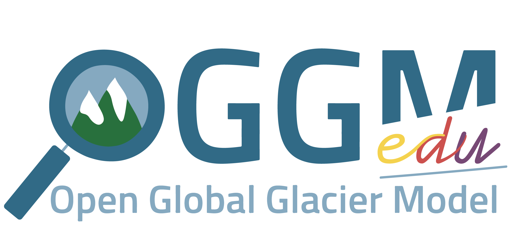
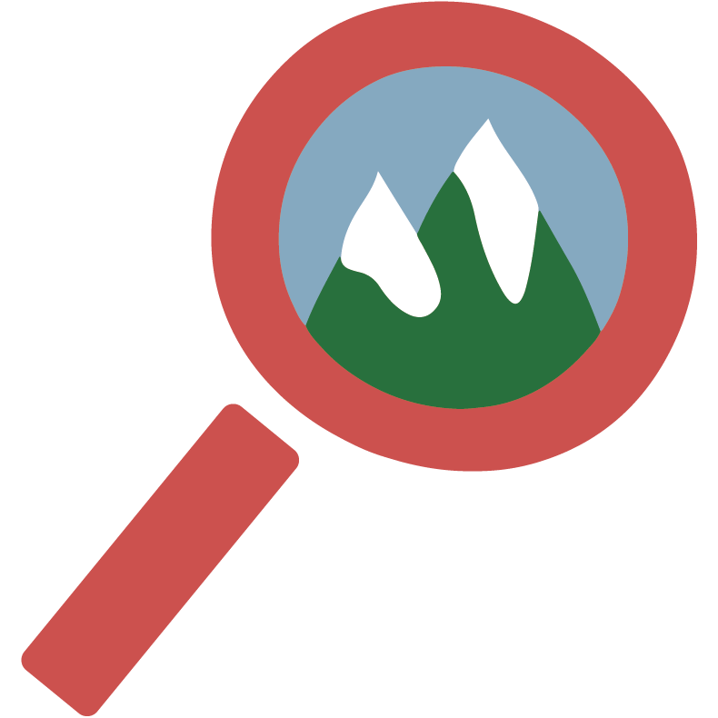
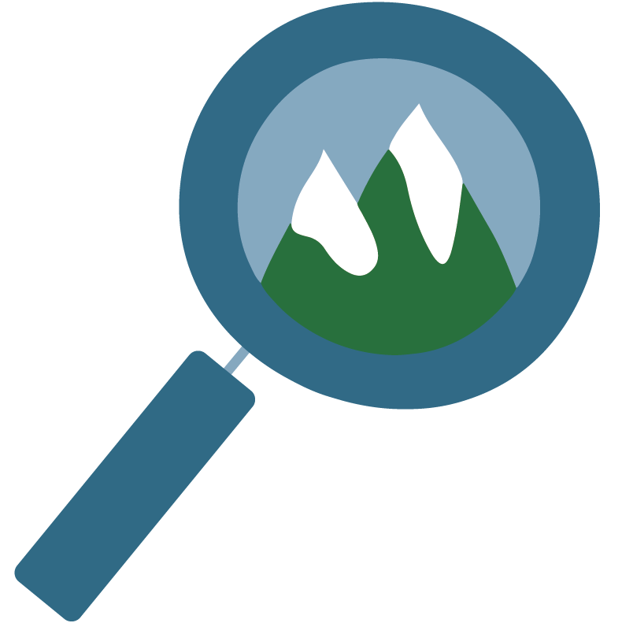
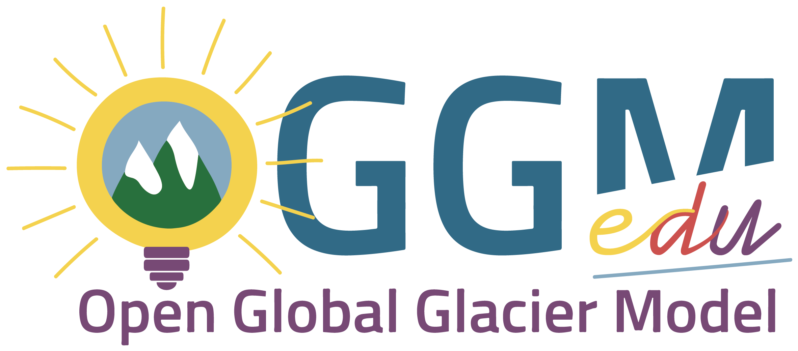
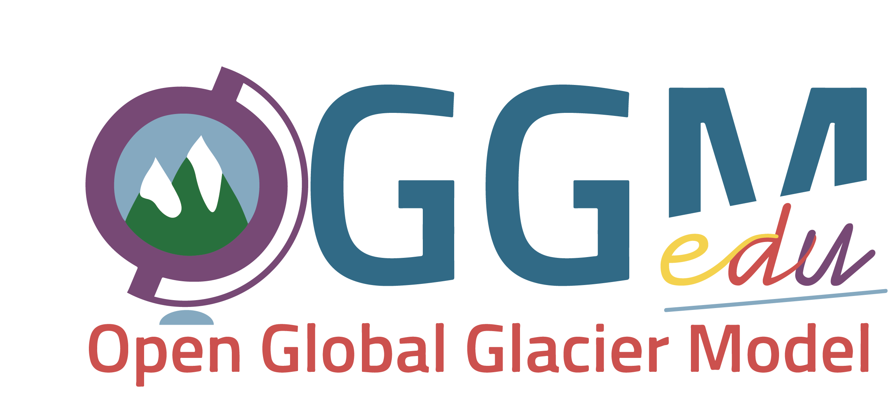
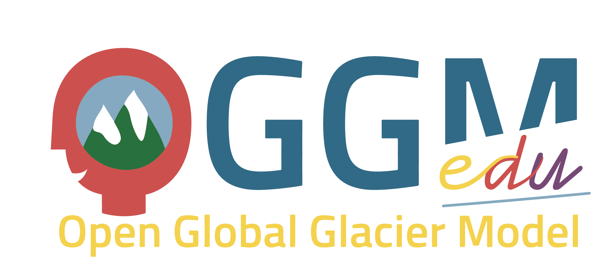
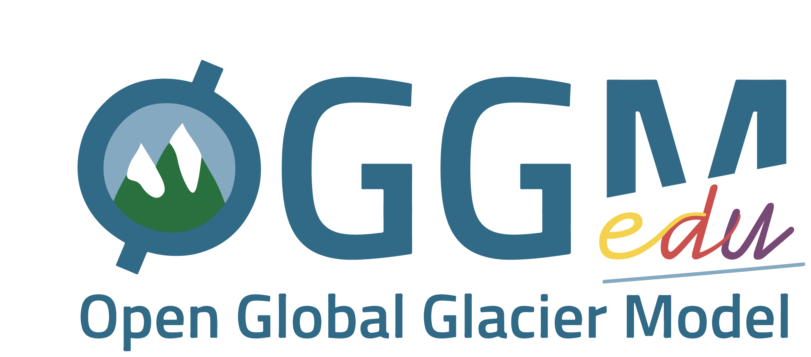
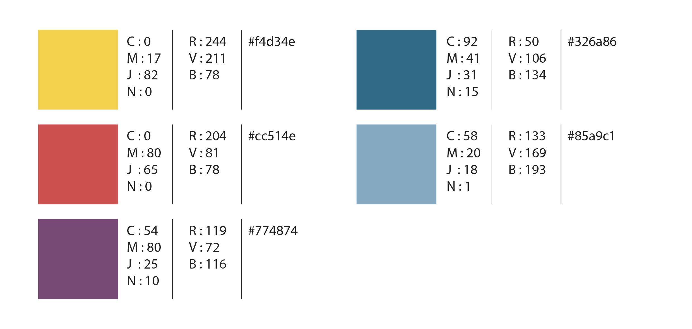

.. _charter:

Logos and colors
================

The OGGM-Edu logos are free to use. They were realized by Anne Maussion,
`Atelier les Gros yeux <http://atelierlesgrosyeux.com>`_.

Official logo
-------------

If you want to use an OGGM-Edu logo for a poster or a website, we recommend to
use the following:

**full logo**:
`large (2364x1041) <_static/logos/oggm_edu_l.png>`_,
`large (2364x1041) with alpha channel <_static/logos/oggm_edu_l_alpha.png>`_,
`small (512x225) <_static/logos/oggm_edu_s.png>`_,
`small (512x225) with alpha channel <_static/logos/oggm_edu_s_alpha.png>`_

**For darker backgrounds**, here is a version with other colors:
`db large (2364x1041) with alpha channel <_static/logos/oggm_edu_l_alpha_db.png>`_,
`db small (512x225) with alpha channel <_static/logos/oggm_edu_s_alpha_db.png>`_

Icons
-----

**icon logo**:
`large (790x790) <_static/logos/oggm_edu_icon.png>`_,
`small (64x64) <_static/logos/oggm_edu_icon_64.png>`_,
`very small (32x32) <_static/logos/oggm_edu_icon_32.png>`_
`large blue (790x790) <_static/logos/oggm_edu_icon_blue.png>`_,
`small blue (64x64) <_static/logos/oggm_edu_icon_blue_64.png>`_,
`very small blue (32x32) <_static/logos/oggm_edu_icon_blue_32.png>`_

Other logos
-----------

At OGGM-Edu we are in favor of diversity! Here are some alternative logos you
can pick from:

Lightbulb
~~~~~~~~~

**full logo**:
`lightbulb large (2364x1041) <_static/logos/oggm_edu_bulb_l.png>`_,
`lightbulb large (2364x1041) with alpha channel <_static/logos/oggm_edu_bulb_l_alpha.png>`_,
`lightbulb small (512x225) <_static/logos/oggm_edu_bulb_s.png>`_,
`lightbulb small (512x225) with alpha channel <_static/logos/oggm_edu_bulb_s_alpha.png>`_

**darker background logo**:
`db lightbulb large (2364x1041) with alpha channel <_static/logos/oggm_edu_bulb_l_alpha_db.png>`_,
`db lightbulb small (512x225) with alpha channel <_static/logos/oggm_edu_bulb_s_alpha_db.png>`_

Globe
~~~~~

**full logo**:
`globe large (2364x1041) <_static/logos/oggm_edu_globe_l.png>`_,
`globe large (2364x1041) with alpha channel <_static/logos/oggm_edu_globe_l_alpha.png>`_,
`globe small (512x225) <_static/logos/oggm_edu_globe_s.png>`_,
`globe small (512x225) with alpha channel <_static/logos/oggm_edu_globe_s_alpha.png>`_

**darker background logo**:
`db globe large (2364x1041) with alpha channel <_static/logos/oggm_edu_globe_l_alpha_db.png>`_,
`db globe small (512x225) with alpha channel <_static/logos/oggm_edu_globe_s_alpha_db.png>`_

Face
~~~~

**full logo**:
`face large (2364x1041) <_static/logos/oggm_edu_face_l.png>`_,
`face large (2364x1041) with alpha channel <_static/logos/oggm_edu_face_l_alpha.png>`_,
`face small (512x225) <_static/logos/oggm_edu_face_s.png>`_,
`face small (512x225) with alpha channel <_static/logos/oggm_edu_face_s_alpha.png>`_

**darker background logo**:
`db face large (2364x1041) with alpha channel <_static/logos/oggm_edu_face_l_alpha_db.png>`_,
`db face small (512x225) with alpha channel <_static/logos/oggm_edu_face_s_alpha_db.png>`_

Classic
~~~~~~~

**full logo**:
`classic large (2364x1041) <_static/logos/oggm_edu_classic_l.png>`_,
`classic large (2364x1041) with alpha channel <_static/logos/oggm_edu_classic_l_alpha.png>`_,
`classic small (512x225) <_static/logos/oggm_edu_classic_s.png>`_,
`classic small (512x225) with alpha channel <_static/logos/oggm_edu_classic_s_alpha.png>`_

**darker background logo**:
`db classic large (2364x1041) with alpha channel <_static/logos/oggm_edu_classic_l_alpha_db.png>`_,
`db classic small (512x225) with alpha channel <_static/logos/oggm_edu_classic_s_alpha_db.png>`_

Color specifications
--------------------

