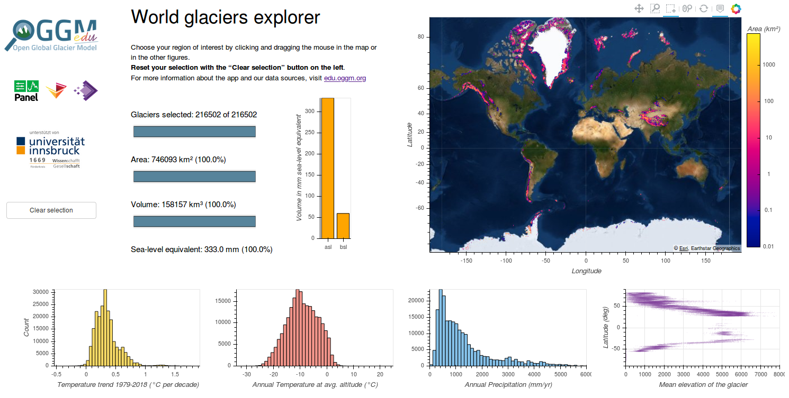

.. _explorer:

World Glaciers Explorer
=======================

The world glacier explorer is an **interactive web application** with which
you can learn (and teach) about the world's glaciers, their location,
their climate, and the ice they store. By "glaciers", we mean all glaciers
outside of the two continental ice sheets (Greenland and Antarctica).

You can start the app by clicking on this link: |badge_bokeh_en|_

.. _badge_bokeh_en: https://bokeh.oggm.org/explorer/app

Alternatively, you can start the app `on mybinder <https://mybinder.org/v2/gh/OGGM/world-glacier-explorer/master?urlpath=panel/app>`_
(slightly slower in general, but a good alternative if our server is saturated).
If you want to run the app on your own computer, see :ref:`docker-launch` below.

**The app contains five elements**:

- the **world map** (upper right) displays thg glaciers' location, with the color shading
  indicating the total glacier area in each pixel. Moving the mouse over a glacier
  pixel displays its exact glaciated area. When selecting a box on the map,
  the other elements in the app will update accordingly. Above the map, there is
  a toolbar: with the "Box Zoom" button, you can also zoom into a specific
  region. Click on "Reset" to set the map back to defaults (see the video below
  for a demo). *Be aware that
  the map projection is slightly misleading: high latitudes appear much
  bigger on the map than they really are.*
- the **clear selection button** on the left resets the current glacier selection.
- the **bar plots** (left of the map) indicate various statistics about the current
  glacier selection (default selection: all glaciers). The upper blue bar
  indicates the number of glaciers selected, the middle blue bar their total
  area, and the lower blue bar their estimated volume. This volume can be
  converted to its *sea-level rise equivalent* (in mm), which is the global
  sea-level rise to be expected if all glacier vanished. Only glaciers *above*
  sea-level are contributing to this figure, therefore there are two vertical
  orange bars:
  *asl* (above sea-level) and *bsl* (below sea-level). See the demo and
  explanations below on how to use this information.
- the three **climate histograms plots** (lower row) display the distribution
  of the selected glaciers' climate conditions. The y-axis is given in number
  of glaciers per bin, and the x-axis in the unit of the target variable
  (temperature trend, average temperature, average precipitation at the glacier
  location). Selecting a range of values in these plots also actualizes the map
  and the rest of the plots (see demo below).
- the **glacier elevation/altitude scatter plot** (lower right) displays the
  average elevation of the glaciers on the map as a function of latitude (y-axis).

Video tutorials
---------------

Part 1: app functionalities
~~~~~~~~~~~~~~~~~~~~~~~~~~~

.. raw:: html

  <iframe src="https://player.vimeo.com/video/422776970" width="640" height="357" frameborder="0" allow="autoplay; fullscreen" allowfullscreen></iframe>
  
<a href="https://vimeo.com/422776970">OGGM-Edu app: World Glaciers Explorer tutorial (part 2) on Vimeo</a>

Part 2: example questions
~~~~~~~~~~~~~~~~~~~~~~~~~

.. raw:: html

  <iframe src="https://player.vimeo.com/video/425084908" width="640" height="357" frameborder="0" allow="autoplay; fullscreen" allowfullscreen></iframe>
  
<a href="https://vimeo.com/425084908">OGGM-Edu app: World Glaciers Explorer tutorial (part 2) on Vimeo</a>

Questions to explore with this app
----------------------------------

With this app, you can address many questions, by yourself or in class! For example:

- How many glaciers are there on Earth? How much volume do they represent?
- How much would the sea-level rise if all glaciers melted? All glaciers in the
  Alps? In the Himalayas? etc.
- What is the relationship between latitude and glacier elevation? Why?
- Where are the locations with highest precipitation? And the driests?
- Is there a relationship between average temperature and average precipitation?
- How much glacier area is found on Greenland? In the European Alps? How does
  these number compare to, say, the area of Berlin, France, Mexico?
- Does the number of glaciers in a region always correlate with their total volume?
- What regions are most likely to contribute to sea-level rise? Where do we
  find glaciers with ice below sea-level?
- Where are the glaciers which are warming the fastest? Why?
- Where are the wettest glaciers in the Himalayas? (select all Himalayan glaciers
  first, then the wettest). Can you explain why?
- Repeat the excercise above with other regions: Greenland, the Alps, etc.
- And many more!

Resources
---------

- Several pages from `Glaciers and Climate <http://www.antarcticglaciers.org/glaciers-and-climate/>`_ on `antarcticglaciers.org`_ are highly relevant here
- `Warming trends at glaciers locations <https://fabienmaussion.info/2019/08/29/era5/>`_, a blog post by Fabien Maussion
- `Glacial Census Reveals Ice Thicknesses Around the World <https://eos.org/articles/glacial-census-reveals-ice-thicknesses-around-the-world>`_, EOS

.. _antarcticglaciers.org: http://www.antarcticglaciers.org/

Authors
-------

`Philipp Rudiger <https://github.com/philippjfr>`_ and
`James Bednar <https://github.com/jbednar>`_ from
`HoloViz <http://holoviz.org//>`_ and Anaconda Inc., based on an original
Dash application by `Fabien Maussion <https://fabienmaussion.info/>`_.
`Zora Schirmeister <https://github.com/zschirmeister>`_ improved the app
with new data, plots, and an improved layout.

Data sources
------------

Glacier location, elevation and area are obtained
from the `Randolph Glacier Inventory version 6 <https://www.glims.org/RGI/>`_.
The climate data (temperature, precipitation, trends) is extracted from
`ERA5 data <https://www.ecmwf.int/en/forecasts/datasets/reanalysis-datasets/era5>`_
provided by the `ECMWF <https://www.ecmwf.int/>`_.
The glacier volume was provided by `Farinotti et al., (2019) <https://www.nature.com/articles/s41561-019-0300-3>`_

Source code
-----------

Code and data are on `GitHub <https://github.com/OGGM/world-glacier-explorer>`_, MIT licensed.

.. _docker-launch:

Launching from Docker
---------------------

This application should work quite well online, either on our server or on
mybinder. But you can also start the app locally, which will make it
faster and less dependent on an internet connection (although you still
need one to download the app, display the logos and the map).

To start the app locally, all you'll need is to
have `Docker <https://www.docker.com/>`_ installed on your computer.
From there, run this command into a terminal:

    docker run -e BOKEH_ALLOW_WS_ORIGIN=127.0.0.1 -p 8080:80 oggm/bokeh:20191210 git+https://github.com/OGGM/world-glacier-explorer.git app.ipynb

Once running, you should be able to start the app in your browser at this
address: `http://127.0.0.1:8080/ <http://127.0.0.1:8080/>`_.

Possible future improvements
----------------------------

- With a category choice bar, it would be possible to differentiate glaciers
  from ice-caps or marine terminating glaciers from land-terminating ones.
- We could also simplify the app for younger target audiences, with less
  panels and less distraction.
