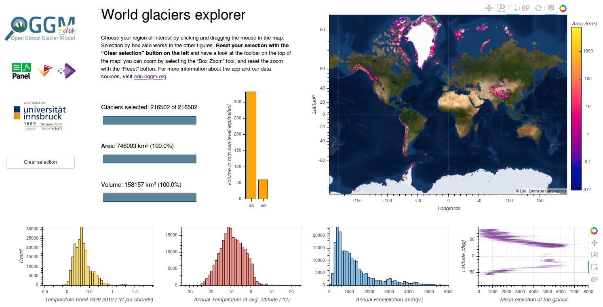

.. _explorer:

World Glaciers Explorer
=======================

The world glacier explorer is an interactive application allowing to explore
the location of the glaciers and their climate.

You can start the app by clicking on this link: |badgelink|_

.. |badgelink| image::  https://img.shields.io/badge/launch-bokeh%20app-579ACA.svg?style=popout&logo=     data:image/png;base64,iVBORw0KGgoAAAANSUhEUgAAACAAAAAgCAYAAABzenr0AAAABmJLR0QA/wD/AP+gvaeTAAAACXBIWXMAAC4jAAAuIwF4pT92AAAAB3RJTUUH4wEeDC0U4ki9ZgAAABl0RVh0Q29tbWVudABDcmVhdGVkIHdpdGggR0lNUFeBDhcAAAQFSURBVFjD7ZddaBxVGIafc2Y22+1u0qSxyaZJbBMTxLapUseUIsWWWrRIFhYL9bfgjdirQgX1qhUUb7zwQnqhghZ7IYo4MKJoo1YUtcQxlTRpWkyWGEp+l+zmZ5vs7swcL9yENeruxhi9yXc358z5nvfM9853ZgT/X/gAyXqsx3r8W2FHI9jRyNpDll1X2dFIVbH7CoVYCdgwLexoZA/wDHA34M/lSAE9wNuGaX2/fM2qBCyDnwFOCKU2S9fxCaUAUEKgpHQ8qc0BJvC8YVqTpYjQS3kCOfgrwEnheRvnqrYwuHMv09V1eEISnE2wdahfDw9fr9SczFNKyDvsaOSYYVrDxcohiu0+Bz8CnBeeVz1y2y6utD+AEmIpgRDgIqkeH2aH/QWhZBwl5SfAE4ZpJRfzrMYDF4XnHUjUNtJ16BgqN66UIlxVjtFSzzd9Q0ylXcKjMXb+2MnG2SRKiCeB9wzTcv8utywBbgBNUnn07zmIAny6JBTwo3DZFMpyZ3MYo7Uezc0y1thKvK4JT2oAJ4CyQvlLOQ7bhPJCc5XVpCo2A3BPawOHdjdzIxHj3LdnSaQSNIcrqa0MQNYhXredrD8ASrUX81kpAiqFUr754CZQCp8uOdDWREt9JRv8ccaTE3THekllphhJ/oLrZkgHQniatmhyXyEjliIgpRBuWXoeIXXiswN0DXTj18t45N7DzMyn+CnWw+R0nK7YV8RTN/C5DsLzFterQslLeQ17lBSp8mS8SkyPcmHwQ77sf58zR0/RUL0Vv17G11d/YDw5yeDENbRAI/uSG9CzGRBiCEivqg8YpnXJjkauStdtaLjcyUJgBkcpXvroNVrDzWRdh9j4rwyMDZERkBnto2LMh8/J4sEHgPOPPbBUOyFedGGiZXyC44kgITTG5mf4bqAbD3AFpHVBrSrjyMgs4dk5FGoGOA9kCjG0EpqQnPn5cnzLQx1pJx4/uH1earendSrQUJpECMEtjmTfTT8PJwPctVCGD4GCU8Dnhml5djTCm9eul16CZa49Wb6r7bi/pubizWDwsDY9/fKOBX3/toxGSvrJCtAUBD1ByBMACwpeAM4ZpuUUOwtEkd13AK8D24TuQ7nOgyhlA3sFPAbsB27NOT2m4GPgXeDKIrxQG/5LAXnw3cBbQHtuqhe4zzCtKTsakbnvej3PRx6QBbKGaalS4H8SkAevAc4CR3NTidxu+4olXMm3wJKAfKV2NBIATvN7HRcbSQfwqWFaqpRdrSTkMuUSeDwPDvAscGEt4AAy77EL4H7g1bz5N4B3DNPKrgX8Dx6wo5Fm4DOgNTfUCTxtmNbQWsGXSpAzTSivL/QCp9caDqDnAXrsaORR4DnAMkzr0n/xP/Ebgv/Oed8KI9UAAAAASUVORK5CYII=
.. _badgelink: https://dash.klima.uni-bremen.de/bokeh/app

The app contains five elements:

- the **header text** indicates how many glaciers are currently selected
  (active), and how much of the total area they represent.
- the **top left panel** is a map of the glacier locations and their area. Moving
  the mouse over a glacier pixel gives you its glaciated area. Be aware that
  the map projection is misleading: northern latitudes appear much bigger on
  the map than they really are.
- the **top right panel** displays the elevation of the glaciers with respect to
  their latitude.
- the **bottom left panel** shows the histogram of the glaciers' mean temperature
  (at the glacier's mean elevation).
- the **bottom right panel** shows the histogram of the glaciers' mean annual
  precipitation (liquid and solid).

When selecting data in each of these panels, the other panels are actualized
automatically, allowing to ask questions such as:

- where are the wettest glaciers located? And the driest?
- is there a relationship between temperature and precipitation?
- how much glacier area is found on Greenland? In the European Alps?
- what is the relationship between latitude and glacier elevation?
- ...

Authors
-------

`Philipp Rudiger <https://github.com/philippjfr>`_ and
`James Bednar <https://github.com/jbednar>`_ from
`PyViz <http://pyviz.org/>`_, based on an original
`Dash application <https://dash.klima.uni-bremen.de/apps/explore>`_ by
`Fabien Maussion <https://fabienmaussion.info/>`_.

Data sources
------------

The app displays all glaciers worldwide with the exception of Antarctica, where
no climate data is available. Glacier location and area are obtained
from the `Randolph Glacier Inventory version 6 <https://www.glims.org/RGI/>`_.

The climate data (temperature and precipitation) is extracted from the
CRU TS v4.01 data `provided <https://crudata.uea.ac.uk/cru/data/hrg/>`_
by the Climatic Research Unit of the University of East Anglia.

Topography data is obtained from
`various data sources <https://docs.oggm.org/en/latest/input-data.html#topography-data>`_.

The data processing was realized with the OGGM model for
`this scientific paper <https://www.geosci-model-dev-discuss.net/gmd-2018-9/>`_.

Possible improvements
---------------------

- By using other data sources (e.g. ERA-5), it would be possible to plot
  the Antarctic glaciers as well.
- With a category choice bar, it would be possible to differentiate glaciers
  from ice-caps or marine terminating glaciers from land-terminating ones.
- By using the data from the global ITMIX experiment, it is possible to convert a
  selection into sea-level rise equivalent.
