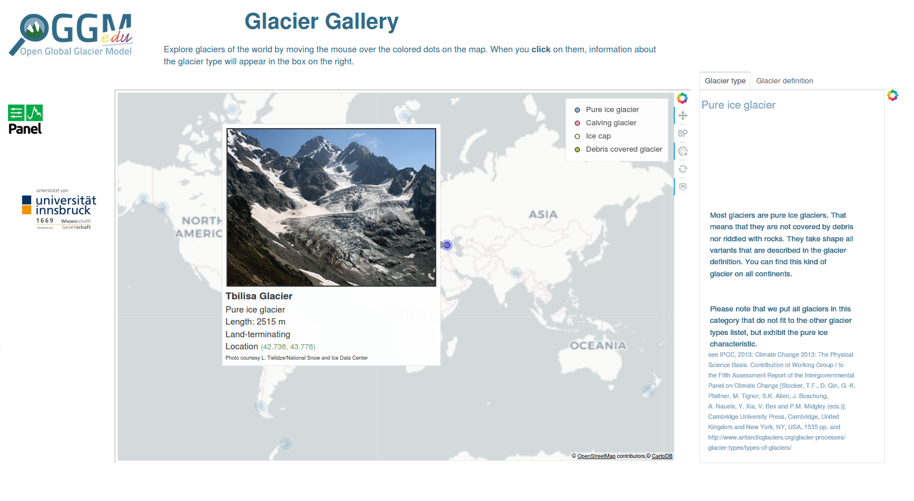

.. _gallery:

Glacier Gallery
===============

The glacier gallery is an **interactive web application** with which
you can learn (and teach) about the diverse glaciers of the world. It introduces
different glacier types with pictures and explanations. It includes example
glaciers from nearly all glaciated regions of the world.

- Start the **english version** of the app by clicking on this link: |badge_bokeh_en|_
- Um die **deutsche Version** der App zu starten, klicke auf den folgenden Link: |badge_bokeh_de|_

.. _badge_bokeh_en: gallery-app_en.html
.. _badge_bokeh_de: gallery-app_de.html

How to use it
-------------

The app contains an interactive **map** with marked glaciers. The markers are
color-coded according to the glacier’s type. When you hover the mouse over a marker,
information about that glacier and a picture of it appears. When you click on
the marker, information about the relevant glacier type pops up in the **infobox** on the
right. The box has a second tab that shows information about glaciers in general.
If you want to choose a different glacier, click anywhere in the map to clear your
selection, and choose a new marker.

Authors
-------

`Zora Schirmeister <https://github.com/zschirmeister>`_

Data sources
------------

Glacier locations and sizes come from the `Randolph Glacier Inventory version 6 <https://www.glims.org/RGI/>`_.

See the app for links to other data sources and pictures.

Source code
-----------

Code and data are on `GitHub <https://github.com/OGGM/glacier-gallery>`_, BSD licensed.

Possible future improvements
----------------------------

The application would benefit from additional glaciers in regions that are not yet well
covered. If you are interested to contribute, you can add a glacier and an
image of it into this `list <https://github.com/OGGM/glacier-gallery/blob/master/glacier_data.py>`_.
You can send us the edited file by email or with a GitHub pull request. Thanks!
