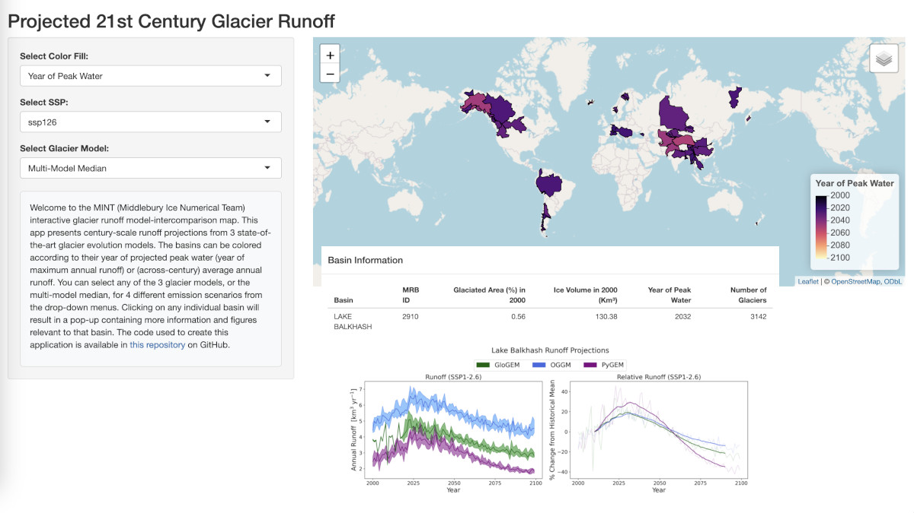

21st century glacier runoff
===========================

Find out about the global future evolution of glacier runoff, and the differences
between three major global glacier models!

This interactive app presents century-scale runoff projections for all major glaciated basins of the world.
The basins can be colored according to their year of projected peak water (year of maximum annual runoff)
or (across-century) average annual runoff. You can select any of the 3 glacier models, or the
multi-model median, for 4 different emission scenarios from the drop-down menus.
Clicking on any individual basin will result in a pop-up containing more information and
figures relevant to that basin.

To start the app, click on this link:

.. image:: https://img.shields.io/badge/Launch-Shiny_App-blue
    :target: https://fwimberly.shinyapps.io/Global_Glacier_Runoff/

|

To learn more about these data and the reasons for the inter-model differences, checkout this
`preprint <https://egusphere.copernicus.org/preprints/2024/egusphere-2024-1778/>`_.

.. admonition:: Interested in climate risks and future glacier changes?

    For detailed insights into climate risks and glacier changes at the country level, visit our `Climate Risk Dashboard <provide_dashboard.html>`_.

Authors
-------

`Finn Wimberly <https://github.com/finnwimberly>`_ and `Lizz Ultee <https://ehultee.github.io/>`_

Data sources
------------

Data: `Wimberly et al. (2024) <https://egusphere.copernicus.org/preprints/2024/egusphere-2024-1778/>`_

Source code
-----------

Code and data are `on GitHub <https://github.com/finnwimberly/glacial_runoff_mapping>`_.
