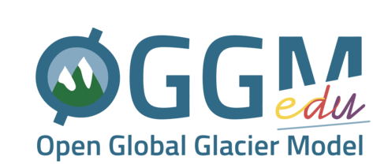

Welcome to OGGM-Edu!
====================

This platform is an educational website about glaciers.

Our main goal is to **provide tools and materials for instructors** who
want to teach about glaciers at school, in workshops or at the university
level. For example, OGGM-Edu was used to conduct
a `weeklong workshop <https://oggm.org/2019/12/06/OGGM-Edu-AGU/>`_
on glaciology and glacial water resources for Peruvian students.

**OGGM-Edu has four independent components**, serving complementary purposes:

1. :ref:`title_apps`, to illustrate glaciological processes with the
   help of interactive graphics on the web. The targeted audience is very
   broad, from school children to adults, with or without scientific background.
2. :ref:`title_graphics`, open access images and graphics that can be used
   for lectures or presentations.
3. :ref:`title_notebooks`, for students willing to run and develop
   their own experiments. The targeted audience are students at the undergrad
   or graduate level with some programming experience, or under the supervision
   of an instructor who can show them how to run the experiments.
4. :ref:`title_tuto`, for current and future users of the Open Global Glacier
   Model. These notebooks are targetting graduate students or scientists aiming
   to learn how the model works.

OGGM-Edu focuses on interactive content and numerical glacier experiments.
We do not provide resources about fundamentals in glaciology or
climate science: for good textbook material refer to
:ref:`other_resources`, which OGGM-Edu intends to complement.

.. _title_apps:

Interactive apps
^^^^^^^^^^^^^^^^

These interactive apps can be run on any computer with an internet connection.

* :doc:`gallery`
* :doc:`explorer`
* :doc:`simulator`
* :doc:`alps_future`

.. toctree::
    :maxdepth: 1
    :hidden:
    :caption: Interactive apps

    gallery.rst
    explorer.rst
    simulator.rst
    alps_future.rst

.. _title_graphics:

Graphics
^^^^^^^^

Open access images and graphics that can be used for lectures or presentations.

* :doc:`glacier_basics`
* :doc:`glacier_lowpass`

.. toctree::
    :maxdepth: 1
    :hidden:
    :caption: Graphics

    glacier_basics.rst
    glacier_lowpass.rst

.. _title_notebooks:

Interactive Notebooks
^^^^^^^^^^^^^^^^^^^^^

Collection of notebooks with simple experiments explaining one or more
glaciological concepts. They are relatively easy to follow and adapt with some
background in programming, and we are working to make them as accessible as
possible. Read our :ref:`notebooks_howto` first if you are new to these things.

* :doc:`notebooks_howto`
* :doc:`notebooks_flowline_intro`
* :doc:`notebooks_ice_flow_parameters`
* :doc:`notebooks_surging_glaciers`
* :doc:`notebooks_mass_balance_gradient`
* :doc:`notebooks_temperature_index_models`
* :doc:`notebooks_accumulation_and_ablation`
* :doc:`notebooks_advance_and_retreat`
* :doc:`notebooks_real_glacier_simulations`

.. toctree::
    :maxdepth: 1
    :hidden:
    :caption: Interactive Notebooks

    notebooks_howto.rst
    notebooks_flowline_intro.rst
    notebooks_ice_flow_parameters.rst
    notebooks_surging_glaciers.rst
    notebooks_mass_balance_gradient.rst
    notebooks_temperature_index_models.rst
    notebooks_accumulation_and_ablation.rst
    notebooks_advance_and_retreat.rst
    notebooks_real_glacier_simulations.rst

.. _title_tuto:

OGGM tutorials
^^^^^^^^^^^^^^

These are more advanced notebooks, for current and future users of the
OGGM model.

* :doc:`oggm_tuto`

.. toctree::
    :maxdepth: 1
    :hidden:
    :caption: OGGM tutorials

    oggm_tuto.rst

For instructors and teachers
^^^^^^^^^^^^^^^^^^^^^^^^^^^^

Thanks for considering OGGM-Edu for your classes! We've gathered some
recommendations and guidelines here.

* :doc:`classes_howto`
* :doc:`user_content`
* :doc:`technical_details`
* :doc:`other_resources`
* :doc:`charter`
* :doc:`roadmap`

.. toctree::
    :maxdepth: 1
    :hidden:
    :caption: For instructors and teachers

    classes_howto.rst
    user_content.rst
    technical_details.rst
    other_resources.rst
    charter.rst
    roadmap.rst

.. _title_contact:

Get in touch
^^^^^^^^^^^^

Interested in OGGM-Edu? We would love to hear from you!

- All of this website and notebooks are located `on GitHub`_.
- Report bugs or share your ideas on the `issue tracker`_.
- Improve the website by submitting a `pull request`_.
- Follow us on `Twitter`_.
- Or you can always send us an `e-mail`_ the good old way.

.. _e-mail: info@oggm.org
.. _on GitHub: https://github.com/OGGM/oggm-edu
.. _issue tracker: https://github.com/OGGM/oggm-edu/issues
.. _pull request: https://github.com/OGGM/oggm-edu/pulls
.. _Twitter: https://twitter.com/OGGM_org

Acknowledgements
^^^^^^^^^^^^^^^^

OGGM-Edu is an affiliated project of the larger OGGM consortium
(`oggm.org <https://oggm.org>`_). It is mainly the work of volunteers, but we
also had support from various sources:

- the University of Innsbruck, Förderkreis **1669** – **Wissen** schafft
  Gesell **schaft** (2019-2020).
- the German BMBF (project FKZ 01LS1602A, 2017-2019).
- `Google Cloud | Data Solutions for Change`_ who provided cloud computing
  and hosting credits (2019-2020).
- the University of Innsbruck, department of
  `Digital Sciences <https://www.uibk.ac.at/zid/abteilungen/lt/>`_
  (Neue Medien Projekte, 2018).
- the OGGM e.V. organisation, who supported the creation of the OGGM-Edu logo
  and of the glacier graphics.

.. raw:: html

    
    
    
    
    
    

We rely on awesome open source tools to run OGGM-Edu! Most notably:

- `Jupyter <https://jupyter.org>`_
- `MyBinder <https://mybinder.org>`_
- `HoloViz <http://holoviz.org/>`_
- `ReadTheDocs <https://readthedocs.org>`_
- and many (many) other packages of the scientific python ecosytem

Last but not least: thanks to all OGGM-Edu friends and contributors!
For a full list, see our
`github repository <https://github.com/OGGM/oggm-edu/graphs/contributors>`_.

.. _Google Cloud | Data Solutions for Change: https://cloud.google.com/data-solutions-for-change
