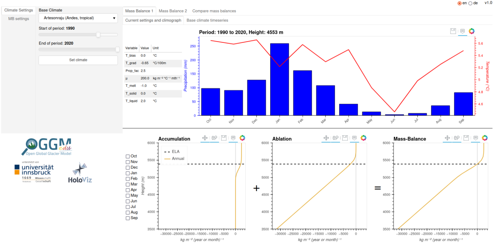

.. _MBsimulator:

Mass-Balance Simulator
======================

The Mass-Balance simulator is an **interactive web application** with which you can learn (and teach) about glacier climatic mass-balance (MB), including the influence of different climate environments and different MB model parameter settings.

You can start the app by clicking on this link: |badge_bokeh_en|_

.. _badge_bokeh_en: https://bokeh.oggm.org/mb_simulator/app

.. note::

  The app uses computer resources on the cloud. It is quite heavy in graphical
  resources, which makes updates to the plot a bit slow (several seconds).
  If the app is *very* slow when many people use it at the same time (in a class),
  we recommend to also use the app
  `on MyBinder <https://mybinder.org/v2/gh/OGGM/mb_simulator/stable?urlpath=panel/app>`_
  or even locally on your own computer (see :ref:`docker-launch-mb-simulator` below).

Getting started with the app
----------------------------

The MB simulator is structured in three parts:

- under 'Mass Balance 1' and 'Mass Balance 2', individual MB models can be defined (with their particular climates and model parameter settings) and explored (up to the monthly contributions).
- under 'Compare mass balances', the two individual MB models are compared to each other.

For an introduction on how to interact with the app and what the individual figures, watch the tutorial video below!

Video tutorial
---------------

.. raw:: html

  <iframe src="https://player.vimeo.com/video/645151831" width="640" height="357" frameborder="0" allow="autoplay; fullscreen" allowfullscreen></iframe>
  
<a href="https://vimeo.com/645151831">OGGM-Edu app: Mass Balance Simulator tutorial on Vimeo</a>

Theoretical Background
----------------------

The MB describes the ice gain and loss of a glacier system. For a general introduction, visit `antarcticglaciers.org (mass-balance)`_.

MB model
~~~~~~~~

The actual equation in the background of the app is a so-called "monthly temperature-index model", as explained in the `OGGM Docs`_. In short:

- The model estimates the ablation (mass loss) only as a function of monthly mean temperature. Whenever the temperature is above a certain threshold (``T_melt``) ice melt is assumed. How much ice melt is determined by the temperature sensitivity parameter (μ) multiplied by the number of degrees above ``T_melt``.
- The daily/monthly temperature cycle isn't taken into account, but ice melt may occur (e.g. around noon) also on days/months with a negative mean temperature. Therefore the monthly melt threshold (``T_melt``) is often set to negative temperatures to account for this.
- The model estimates the accumulation (mass gain) as a function of precipitation and temperature, where the temperature determines the fraction of solid precipitation.
- For real-world applications, the sensitivity parameter (μ) needs to be calibrated against observation and inherently will account also for all other processes and properties not directly considered by the model (e.g. slope aspect, wind-blown snow, avalanching, ...).

.. admonition:: More details
    :class: toggle

    One should keep in mind that the actual ice melt is described by the whole surface energy balance (including shortwave/longwave radiation,
    latent/sensible heat flux, surface properties,...) and not the temperature alone. This model clearly is a simplification!
    Numerous studies have shown that it is quite a good one, but its accuracy varies with the climate settings.
    The purpose of this app is not to discuss this, but rather to illustrate how this MB model works.

Dataset
~~~~~~~

The temperature and precipitation data is extracted from the `CRU TS v4 Dataset`_. In short:

- CRU TS v4 is a global gridded dataset (0.5° regular grid) derived from weather station observations. It covers the period 1901 - 2020 (updated annually) and provides mean monthly values for each year.
- Whenever there are no observations available for a certain period, the variables are set to their 1961 - 1990 monthly average.
- We extract the nearest grid point to each glacier location - the reference elevation of the climate timeseries therefore
  often does not correspond to the glacier elevation. The temperature is corrected with the ``T_grad`` parameter.

Questions to explore with this app
----------------------------------

With this app, you can address many questions, by yourself or in class! This list will grow in the future (documentation takes time!).

Monthly contributions to annual MB
~~~~~~~~~~~~~~~~~~~~~~~~~~~~~~~~~~

**Experiment:**

- Choose as a base climate 'Hintereisferner (Alps, continental)' and leave all the other settings unchanged.
- Now look at the climograph (showing precipitation and temperature at each month) and try to answer the questions below.

**Questions to answer:**

By only looking at (or moving with your mouse over) the climograph, try to guess:

- In which month do you think the accumulation is largest at 4000 m?
- In which month do you think the ablation is largest at 2000 m?
- Which month has the lowest altitude with a MB of 0 kg m⁻² month⁻¹ (lowest monthly Transient Equilibrium Line Altitude, T-ELA)?

After you made your guesses, you can compare the different months by switching them on and off at the left of the accumulation plot.
Tip: Move your mouse over the plots to get exact values.

.. admonition:: Take home messages
    :class: toggle

    - Largest accumulation at 4500 m in June, the month with the largest precipitation amount - Largest ablation at 2000m in July,
      the month with the highest temperature
    - Lowest monthly T-ELA is in December. Indeed, January has the
      lowest temperature, but December has more precipitation
    - Advanced comment: comparing ablation values in December and
      January at 1600 m shows slightly more negative values in January than December. But from the definition of the
      ablation we would expect a more negative value for December when only looking at the mean temperature shown in the
      climograph (the lower the temperature the smaller the ablation). This is an example showing the difference of
      calculating the monthly MB FOR each month and then calculating the mean (as it is done here), or first
      calculating a mean temperature for a month and then using this for the calculation of the monthly MB. For more
      information, look at this `OGGM Blogpost`_.

Compare different locations/climates
~~~~~~~~~~~~~~~~~~~~~~~~~~~~~~~~~~~~

**Experiment:**

- Define two different base climates for 'Mass Balance 1' ('Hintereisferner (Alps, continental)') and 'Mass Balance 2' ('Echaurren Norte (Andes, mediterranean)') for the period 1990 - 2020, with the default MB settings.
- Go to 'Compare mass balances' and compare them ;).

**Questions to answer:**

- Compare the accumulation and ablation at the average Equilibrium Line Altitude (ELA).
- Compare the total MB profile and the position of the ELA.
- *Advanced*: How will these differences influence glacier ice flow?

.. admonition:: Take home messages
    :class: toggle

    - Accumulation and ablation at ELA appr. two times larger at Hintereisferner compared to Echaurren Norte.
    - *Advanced*: This results in a larger MB gradient around the ELA for Hintereisferner. How this influences the glacier flow can be explored with the `Glacier Simulator (Mass-balance gradient)`_.
    - Higher ELA for Echauren Norte is a result of less annual precipitation and higher temperatures.

Compare different periods of the same base climate
~~~~~~~~~~~~~~~~~~~~~~~~~~~~~~~~~~~~~~~~~~~~~~~~~~

**Experiment:**

- Go to 'Mass Balance 1' and choose as base climate 'Lewis (Mount Kenya, tropical)' with period 1902 - 1932.
- Now go to 'Mass Balance 2' and choose the same base climate with the period 1990 - 2020.
- Additionally, you can go to 'Base climate timeseries' to explore the underlying climate dataset periods visually.
- For the comparison now switch to 'Compare mass balances'.

**Question to answer:**

- Interpret the resulting differences by comparing the climographs.
- How are glaciers affected by these differences?

.. admonition:: Take home messages
    :class: toggle

    - higher Temperatures results in a higher ELA in 1990 - 2020 compared to 1902 - 1932
    - but due to the larger total precipitation amount, the mass gain is larger at
      high elevations (>5100 m) in 1990 - 2020 compared to 1902 - 1932

Influence of model settings
~~~~~~~~~~~~~~~~~~~~~~~~~~~

**Experiment (suggestion):**

- Choose the same base climate for 'Mass Balance 1' and 'Mass Balance 2' with the same climate periods.
- Now go to 'MB settings' and change one of the settings for 'Mass Balance 2'.

**Questions to answer:**

- What is the influence on the accumulation, ablation, MB or ELA height?
- Is the influences the same for different base climates?

.. _antarcticglaciers.org (mass-balance): http://www.antarcticglaciers.org/glacier-processes/introduction-glacier-mass-balance
.. _OGGM Docs: https://docs.oggm.org/en/stable/mass-balance.html#temperature-index-model
.. _CRU TS v4 Dataset: https://www.nature.com/articles/s41597-020-0453-3
.. _OGGM Blogpost: https://oggm.org/2021/08/05/mean-forcing/
.. _Glacier Simulator (Mass-balance gradient): https://edu.oggm.org/en/latest/simulator.html#mass-balance-gradient

Authors
-------

`Patrick Schmitt <https://github.com/pat-schmitt>`_ and
`Fabien Maussion <https://fabienmaussion.info/>`_.

Source code
-----------

Code and data are on `GitHub <https://github.com/OGGM/mb_simulator>`_, BSD3 licensed.

.. _docker-launch-mb-simulator:

Launching from Docker
---------------------

This application can keep a single processor quite busy when running. Fortunately,
you can also start the app locally, which will make it
faster and less dependent on an internet connection (although you still
need one to download the app and display the logos).

To start the app locally, all you'll need is to
have `Docker <https://www.docker.com/>`_ installed on your computer.
From there, run this command into a terminal::

    docker run -e BOKEH_ALLOW_WS_ORIGIN=0.0.0.0:8080 -p 8080:8080 oggm/bokeh:20211010 git+https://github.com/OGGM/mb_simulator.git@stable app.ipynb

Once running, you should be able to start the app in your browser at this
address: `http://0.0.0.0:8080/app <http://0.0.0.0:8080/app>`_.
