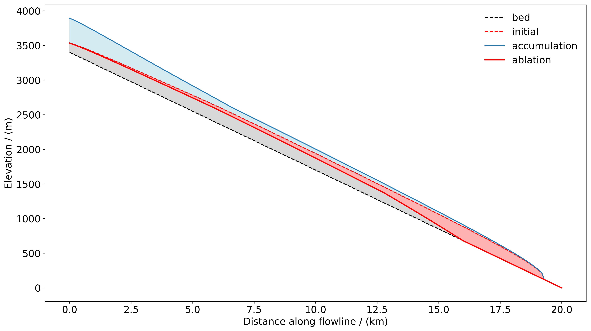

.. _notebooks_accumulation_and_ablation:

Accumulation, ablation and glacier mass balance
===============================================

	Figure: Schematic representation of glacier mass balance as the sum of accumulation and ablation.

This notebook provides a general overview of accumulation and ablation processes and how they determine
glacier mass balance and ice flow. To open the notebook in your browser, click
the button below.

|badge_edu_notebooks|
