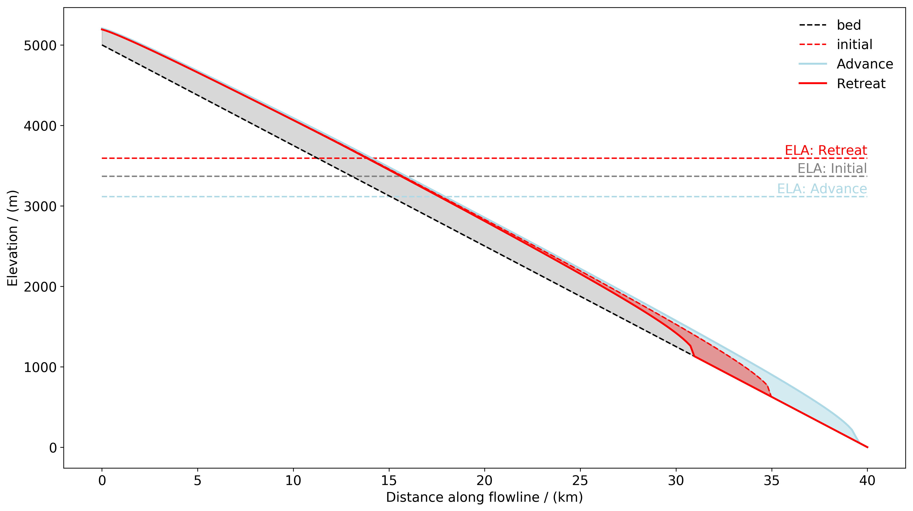

.. _notebooks_advance_and_retreat:

Glacier advance and retreat
===============================================

	Figure: Glacier advance (retreat) as a result of a decrease (increase) in the equilibrium line altitude.

This notebook explains the concept of the equilibrium line altitude (ELA) and simulates glacier advance and retreat
in response to a change in the ELA. To open the notebook in your browser, click the button below.

|badge_edu_notebooks|
