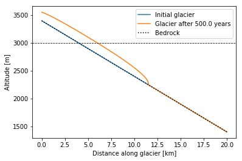

.. _notebooks_flowline_intro:

Glacier flowline modelling
==========================

    Figure: Geometry of a glacier model after 500 years, that moves only from deformation processes.

This notebook is an introduction to flowline modelling with OGGM. To open the notebook in your browser use the button below:

|badge_edu_notebooks|

In this notebook we will set-up a simple model run and visualize it afterwards. Therefore we will learn how to define an easy glacier bed and a suitable grid. The learner will implement mass balance in the form of equilibrium line altitude (ELA) and see how his glacier develops in length, volume and area over certain years.

*Prerequisites:* If you are new to jupyter-notebook, have a look at this short
:ref:`notebooks_howto`. This notebook uses the Python programming language.
If this is completely new for you, we recommend to go through an introductory
tutorial first, or have a teacher or tutor help you out. No need to be a
Python expert to be able to use it, though!
