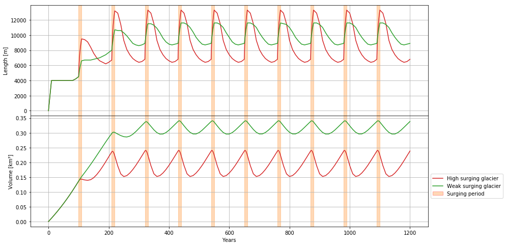

.. _notebooks_surging_glaciers:

Surging glaciers
================

    Figure: Development of two surging glaciers. Upper graph: length, lower graph: volume.

Surging glaciers are glaciers experiencing periodic and sudden advances.
You will learn how to simulate surging dynamics in a glacier model and run
a few experiments with it. To open the notebook in your browser use the button below:

|badge_edu_notebooks|

*Prerequisites:*

- You went through the notebook about glacier flowline modelling, so that you understand the concept of building a simple glacier model with OGGM.
- It is helpful to work through the notebook about ice flow parameters first.

You find these notebooks here: :ref:`title_notebooks`.
