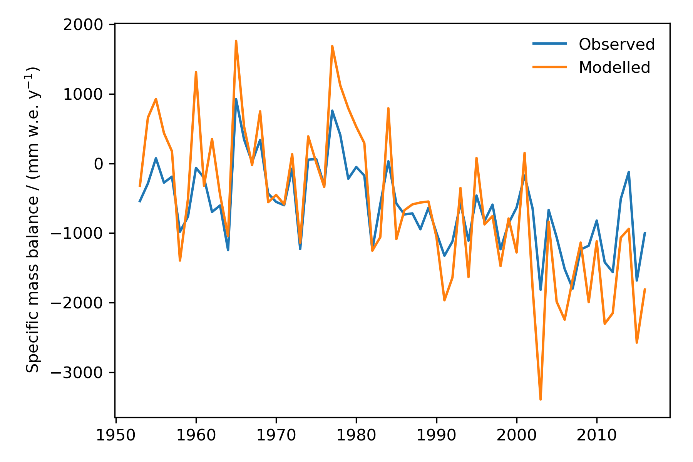

.. _notebooks_temperature_index_models:

Temperature index models
========================

	Figure: Mass balance from in-situ measurements (blue) and mass balance modelled using OGGM's temperature index model (orange).

This notebook provides a general overview of temperature index melt models and an
example implementation in OGGM. To open the notebook in your browser, click
the button below.

|badge_edu_notebooks|

Among others, temperature index models are used to model glacier mass balance.
The idea is to assume an empirical relationship between positive
temperatures and melt rates.
