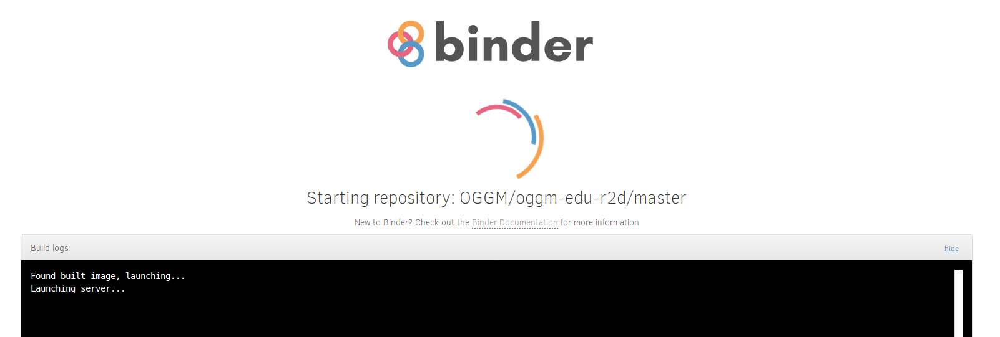
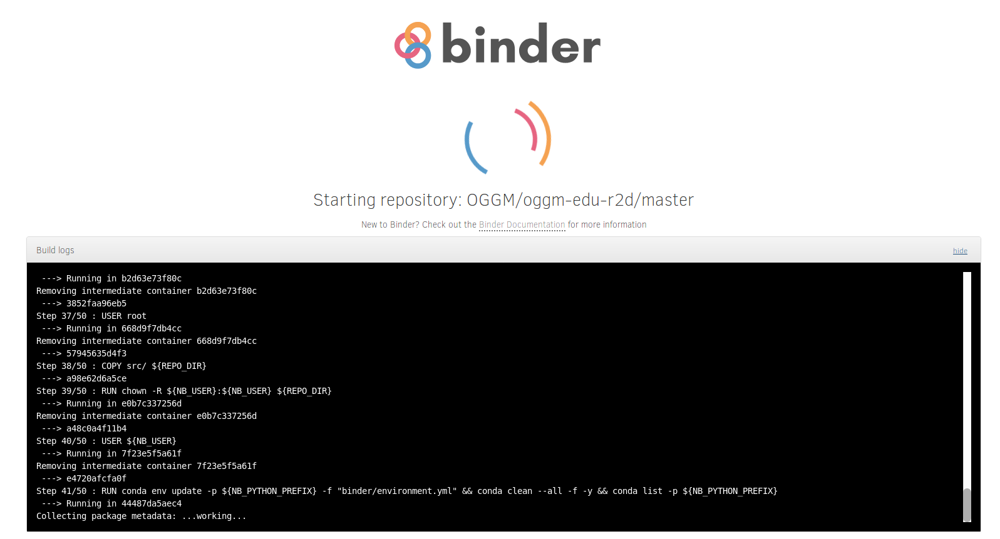
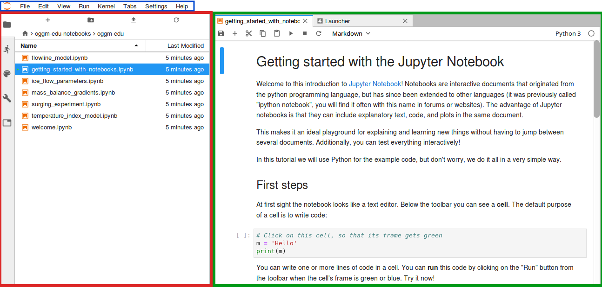
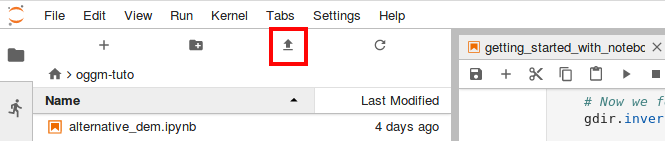

.. _notebooks_howto:

Introduction to interactive notebooks
=====================================

The `OGGM-Edu notebooks <https://oggm.org/oggm-edu-notebooks>`_ offer a programmatic
interface to a glacier model (OGGM). They are developed for university students
with some experience with programming, or who are willing to learn!

We use them in several classes already, and we hope that you will find them
useful too!

If you plan to use OGGM-Edu's educational notebooks (either on your own or in
a class), we recommend to read this short information page first.

Jupyter notebooks
-----------------

The `Jupyter Notebook <https://jupyter.org>`_ is an **open-source web application**
that allows you to create and share documents that contain **live computer code**,
**equations**, **visualizations** and **narrative text**. In OGGM-Edu, we use
notebooks to design and share glacier modelling experiments.

If you are new to Jupyter Notebooks, don't be scared! You can learn about them
and try them out on the `Jupyter website <https://jupyter.org>`_ .
We also have prepared a tutorial for you on OGGM-Edu. Open it in your browser with:

|badge_edu_intro_notebooks|

This link will bring you to an interactive :ref:`binder_simple` environment.
If you prefer to run the notebooks on your personal computer, you can always
download them from our `repository <https://github.com/OGGM/oggm-edu-notebooks>`_
or as a `zip-file <https://github.com/OGGM/oggm-edu-notebooks/archive/master.zip>`_.
However, you will have to `install OGGM <https://docs.oggm.org/en/stable/installing-oggm.html>`_
locally for them to work!

.. _binder_simple:

MyBinder
--------

`MyBinder <https://mybinder.org>`_ is a service that allows us to provide online
computing environments in which OGGM-Edu notebooks can be read and executed.
This is a fantastic service that runs on the cloud - each time a user clicks
on an OGGM-Edu binder link, a so-called "virtual machine" is spun-up and made
accessible via the web-browser.

.. note::

  **These binder environments are safe, anonymous, and temporary**. Temporary
  means non-persistent: if you close the tab in which the environment was opened,
  it is lost. If you open the link again, a new environment will be created for
  you, without your previous modifications. Therefore, if you want to save your
  work for later (i.e. to be able to upload it in a future binder session), don't
  forget to download the files you modified before leaving (see instructions below).
  **Be aware that a Binder environment will be shut down after 10 minutes of
  inactivity** (leaving your tab/window open will count as “activity” only
  if visible, i.e. leaving the tab open but navigating elsewhere will eventually
  shut down your session).

MyBinder is a free service provided generously by the Binder and Jupyter
communities (`FAQ <https://mybinder.readthedocs.io/en/latest/faq.html>`_).
As such, you can expect some waiting time at launch and relatively limited
computer resources. However, these resources should be more than enough to
run the OGGM-Edu notebooks at home or for a workshop. If needed, we also
provide dedicated servers for instructors: see :ref:`technical_details`
for more information.

Starting a MyBinder environment
~~~~~~~~~~~~~~~~~~~~~~~~~~~~~~~

|badge_edu_notebooks|

After clicking on an OGGM-Edu MyBinder link, you should see a loading page
similar to the one below (here with the *show log* button activated):

    A typical binder load page

This page indicates that a working OGGM-Edu environment (called an "image")
was found on the Binder database and is being started for you. **This
image loading can take from a few seconds to a couple of minutes**, depending
on the current workload of the service and whether or not the image was already
loaded on the virtual machine.

In rare cases, you might encouter a start log with more verbose output,
such as this one:

    A binder image build log

This occurs when the image needs to be created anew (refer to
:ref:`technical_details` for more information about why this happens). **In
these rare cases, the builds can take up to 15 minutes**. Be patient!

.. note::

    Sometimes, the log screen might show an error of the type "Failed to connect
    to event stream". When this happens, simply refresh your browser (or
    click on the OGGM-Edu link again)

JupyterLab
~~~~~~~~~~

Once the Binder environment is ready, you should see a page similar to this:

    The JupyterLab environment with the three main areas highlighted.

This is the JupyterLab development environment. It is quite intuitive and most
people find their way through it without major struggle, but you
might want to have a look at the excellent
`documentation <https://jupyterlab.readthedocs.io/en/stable/user/interface.html>`_
as well.

The three main areas highlighted above are:

- **Menu Bar** (blue): top-level menus that expose actions available in JupyterLab
- **Left Sidebar** (red): contains a number of commonly-used tabs, such as a file
  browser (most important), a list of running kernels (i.e.: notebooks) and
  terminals, the command palette, and a list of tabs in the main work area
- **Main Work Area** (green): the main work area in JupyterLab enables you to arrange
  documents (notebooks, text files, etc.) and other activities into panels of
  tabs that can be resized or subdivided. Drag a tab to the center of a tab
  panel to move the tab to the panel. Subdivide a tab panel by dragging a tab
  to the left, right, top, or bottom of the panel

Download and upload files to MyBinder/JupyterLab
~~~~~~~~~~~~~~~~~~~~~~~~~~~~~~~~~~~~~~~~~~~~~~~~

Since your MyBinder environment is temporary, you might find it useful to download
the notebooks you modified during your session, and/or upload notebooks or data
that you store on your computer.

To **download a notebook, use the left sidebar's file explorer**:
right-click on the file you'd like to download and select `Download`. You
can also download the notebook in various static formats
in the menu: `File` → `Export Notebook As` (we recommend
``html``). Be aware that some formats might not export properly.

To **upload a file or notebook, use the up-arrow button on the top of the
sidebar**: you can upload any file - text or data.

    The JupyterLab's upload button (red box)

classroom.oggm.org
------------------

Since August 2021, we provide a dedicated OGGM JupyterLab server running on
a dedicated machine in Bremen. `classroom.oggm.org <https://classroom.oggm.org>`_
(that's its name!) is like `OGGM-Hub <https://docs.oggm.org/en/stable/cloud.html#oggm-hub>`_,
but tailored for instructors and their classes.

The advantages of classroom.oggm.org over Binder are:

- more resources for your students, faster launches
- user management: you can set passwords and user names at wish
- persistent sessions: work can be saved between sessions and log-ins (this is by far the main advantage)

If you are willing to try it out, please :ref:`get in touch <title_contact>` and we will do our best
to let you use it with your class!

Similarly to MyBinder, you can create a link for your students to download
the content of your notebooks repository very easily:

|badge_classroom_tutos|

Enjoy!

.. _nbs_in_class:

For teachers: using notebooks in classes
----------------------------------------

Here are a few recommendations based on our own experience:

**Spend at least two hours explaining the notebook and jupyterlab environments**.
Showing their basic features first, then let the students play with a simple and
short notebook. In a second session (after an hour or so),
summarize the usual pitfalls:

- recognize that notebooks are actual files (not something magical on browser)
- acknowledge that the order of execution of cells matter
- acknowledge that errors in cell execution are OK and can be recovered from
- show how to restart with a fresh notebook
- encourage the use of keyboard shortcuts (such as `[shift+enter]` and
  `[ctrl+m] + key`)

**On MyBinder: avoid bad surprises by explaining to your class that the sessions
are temporary**. Show your students how to download and upload files to
JupyterLab so that they feel comfortable saving their work from time to time.

Whatever your learning goals are, **always plan less than that**. You might
find `this blog <https://medium.com/@jasonjwilliamsny/4-practical-suggestions-for-using-jupyter-notebooks-in-tutorials-9c478c8c0032>`_
and this `free online book <https://jupyter4edu.github.io/jupyter-edu-book/>`_
about teaching with jupyter notebooks useful as well.

If you plan to teach about programming aspects as well as about
glaciology, **focus on the content** more than on the method. Unfortunately
(or fortunately), the "fun" aspect of notebooks and the programming challenges
often distract students from what they are actually doing: glaciology and
climatology. We've seen students googling about how to change a colormap before
even trying to analyse the plot they just produced.

If you have the chance to have more experienced students in the room,
**organize peer-mentoring in groups of 2 or 3**. Students are often better
in mentoring each other than we are.
