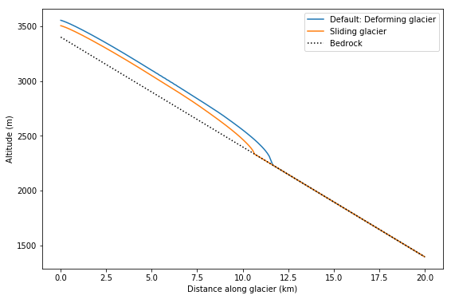

.. _notebooks_ice_flow_parameters:

Ice flow parameters
===================

    Figure: Geometry of glacier models after 1500 years.  Blue graph: glacier moves by deformation, orange graph: glacier that slides also. 

In this notebook we will have a closer look at the parameters that describe ice flow: Glen's creep parameter and the sliding parameter. We will implement them in our model and see their influence on glacier flow.

Open this experiment in your browser with the button below:

.. image:: https://mybinder.org/badge_logo.svg
    :target: https://mybinder.org/v2/gh/OGGM/oggm-edu/master?urlpath=lab/tree/notebooks/oggm-edu/welcome.ipynb

*Prerequisites:* You went through the notebook about `glacier flowline modelling`_, so that you understand the concept of building a simple glacier model with OGGM.

.. _glacier flowline modelling: http://edu.oggm.org/en/latest/notebooks_flowline_intro.html#glacier-flowline-modelling
