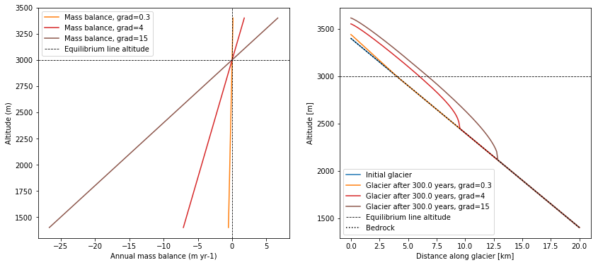

.. _notebooks_mass_balance_gradient:

Mass balance gradient
=====================

    Left figure: Behaviour of different mass balance gradients. Right figure: Geometry of glaciers with different mass balance gradients after 300 years.

In this notebook you will run experiments with a focus on the mass balance gradient. You will see how different mass balance gradients influence the growth of a glacier. Therefore, we calculate our glacier models until they reach an equilibrium state and compare length, area and volume. In addition, we will calculate the volume response times of the glacier models to small climatic changes.

Open this experiment in your browser with the button below:

|badge_edu_notebooks|

*Prerequisites:* You went through the notebook about `glacier flowline modelling`_, so that you understand the concept of building a simple glacier model with OGGM.

.. _glacier flowline modelling: http://edu.oggm.org/en/latest/notebooks_flowline_intro.html#glacier-flowline-modelling
