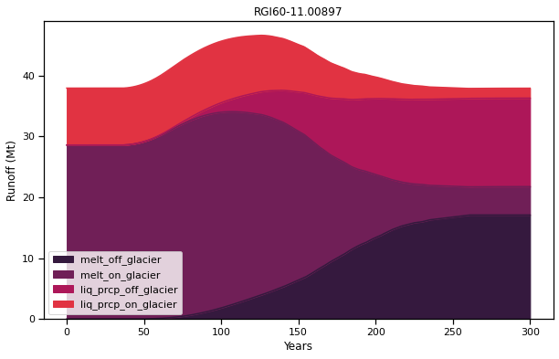

.. _notebooks_real_glacier_simulations:

Glaciers as water resources
===========================

	Figure: Annual cycle of glacier water volume change during the glacier retreat phase (blue) and in equilibrium state (orange).

This notebook simulates the evolution of **real world glaciers** using different climate scenarios to explain their influence on water availability in a catchment.
To open the notebook in your browser, click the button below.

|badge_edu_notebooks|
