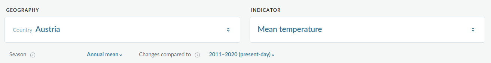

.. _provide_dashboard:

Climate Risk Dashboard
======================

The PROVIDE Climate Risk Dashboard
(`climate-risk-dashboard.climateanalytics.org <https://climate-risk-dashboard.climateanalytics.org/>`_)
is an online platform that offers detailed insights into climate overshoot scenarios, their impacts,
and their reversibility. It provides sector-specific data (e.g., extreme events, biodiversity, sea level rise, glaciers)
at global, national, and city levels. This dashboard is the primary outcome of the
`Horizon 2020 PROVIDE Project <https://www.provide-h2020.eu/>`_.

Overshoot scenarios refer to pathways in which temperature, greenhouse gas concentrations,
or radiative forcing exceed a stabilization target (e.g., the Paris Agreement thresholds)
within a specific timeframe (e.g., before 2100) but return to the target level by the end of that period.
Achieving this typically requires the removal of greenhouse gases through natural or technological sinks.

Here, we provide instructions and examples specifically focused on glaciers.
You will learn how to analyze temperature changes in relation to glacier changes
directly on the dashboard, as well as how to download data for creating your own plots
or conducting more in-depth analyses.

If this is your first visit, a general tutorial video below will guide you through navigating the dashboard.
In the sections that follow the introductory video, you'll find examples related to glacier changes,
starting with simple analyses and gradually moving on to more advanced ones.

.. _video_tutorial:

Video tutorial
--------------

.. raw:: html

  <iframe
    width="640"
    height="357"
    src="https://www.youtube.com/embed/5ucDMJ6wyaM"
    title="PROVIDE Climate Risk Dashboard tutorial on YouTube"
    frameborder="0"
    allow="accelerometer; autoplay; clipboard-write; encrypted-media; gyroscope; picture-in-picture; web-share"
    allowfullscreen>
  </iframe>
  
<a href="https://www.youtube.com/watch?v=5ucDMJ6wyaM">PROVIDE Climate Risk Dashboard tutorial on YouTube</a>

Navigation within the Dashboard
-------------------------------

This section explains how to locate the data used in our exercises, such as mean temperature and glacier volume.
The dashboard also includes many other indicators (e.g., urban climate, biodiversity), so we encourage you
to explore beyond the scope of this guide.

To get started, let’s find the data we’re focusing on. Open the
`Climate Risk Dashboard <https://climate-risk-dashboard.climateanalytics.org/>`_
and click on ``Explore`` in the top-right corner, as demonstrated in the video tutorial above.

.. _geography_and_indicator:

Geography and Indicator
~~~~~~~~~~~~~~~~~~~~~~~

The first step is to choose a ``GEOGRAPHY``. For our exercises, we'll focus on countries with glaciers,
using Austria as an example. To see where glaciers are located worldwide, check out our :ref:`explorer` app.

Next, select the Indicator.

- To find mean temperature: go to ``Indicator > Terrestrial Climate > Mean Temperature``.
- To find glacier volume: go to ``Indicator > Glaciers > Glacier Volume``.

When selecting an indicator, a short explanation will appear, and additional options may be
available. For example, for mean temperature, you can choose the ``Season`` (default: ``Annual mean``)
or defining a reference period in ``Changes compared to`` (default ``2011-2020 (present-day)``,
for comparing to pre-industrial you should select ``1850-1900 (pre-industrial)`` here).

Scenarios
~~~~~~~~~

After selecting geography and indicators, choose a ``SCENARIO`` to analyze. Up to three scenarios
can be selected at once for comparison. Hover over a scenario for more information.
In the example above, we have selected ``Shifting pathway`` and ``2020 climate policies``.

Plots
~~~~~

The dashboard offers three types of plots to analyze data:

- :ref:`timing_plot`: Shows how the indicator changes over time.
- :ref:`location_plot`: Displays the indicator on a map for the selected geography.
- :ref:`risk_plot`: Highlights risks that can or cannot be avoided through emissions reductions.

Each plot has an explanation at the top and options to download the graph or data at the bottom. Below, we explain these plots in more detail.

.. _timing_plot:

Timing
^^^^^^

This plot shows the indicator (y-axis) over time (x-axis). Data is displayed in 5-year intervals, with uncertainty bars for the year 2100 at the right side. Use your mouse to hover over the graph to see exact values for a scenario at a certain year. Buttons to ``Download graph`` and ``Download data`` are at the bottom.

.. _location_plot:

Location
^^^^^^^^

This plot shows the indicator on a grid for the selected geography, with a color bar for values in the bottom right corner. You can choose to display data for the years 2030, 2050, or 2100. If comparing two scenarios, you can view them ``Side by side`` or as a ``Difference`` map. Buttons to ``Download graph`` and ``Download data`` are at the bottom.

.. _risk_plot:

(Un)avoidable risk
^^^^^^^^^^^^^^^^^^

This plot shows the risk of exceeding a specific level for different scenarios (the selected scenarios are shown in colors) in 2020, 2030, 2050, and 2100. You can select the ``Impact level`` (e.g., exceeding +2.0°C compared to today) above the plot. At each year you see a dark gray and a light gray bar:

- Dark gray bars show unavoidable risk.
- Light gray bars show avoidable risk through mitigation actions.

Hover over the dots with your mouse for exact values. Buttons to ``Download graph`` and ``Download data`` are at the bottom.

A user journey with the Dashboard
---------------------------------

Now that we understand the types of data and plots the dashboard provides, let’s explore a practical example. In this example, we will focus on mean temperature and glacier volume for one country. Open the dashboard (`climate-risk-dashboard.climateanalytics.org <https://climate-risk-dashboard.climateanalytics.org/>`_), pick your country, and follow along:

Explore mean temperature changes
~~~~~~~~~~~~~~~~~~~~~~~~~~~~~~~~

**Task:**

Select the Mean Temperature indicator (see instructions in the :ref:`geography_and_indicator` section), choose the default scenario ("2020 climate policies") and a second scenario, and answer the questions below.

**Questions to answer:**

- How is the mean temperature defined? (Hint: Check the description when selecting the indicator.)
- How much warming has your country experienced since pre-industrial times up to 2020? (Hint: Use the :ref:`timing_plot` plot and set the reference period to pre-industrial as explained in :ref:`geography_and_indicator`.)
- What do the two scenarios represent? How are they different (e.g., maximum warming in the period 2020 to 2100 or by 2100)? (Hint: Check the scenario descriptions when selecting or use the :ref:`timing_plot` plot.)
- How does your country’s temperature change compare to global averages for the two scenarios? (Hint: Use the :ref:`timing_plot` plot, set the reference to pre-industrial as explained in :ref:`geography_and_indicator`, and hover over the lines.)
- Where is the strongest temperature change in your country? What are the spatial differences between the scenarios? (Hint: Look at the :ref:`location_plot` plot.)
- What is the unavoidable risk of exceeding +2.0°C by 2100 in your country? How does it differ between scenarios? (Hint: Check the :ref:`risk_plot` plot.)

Explore glacier volume projections
~~~~~~~~~~~~~~~~~~~~~~~~~~~~~~~~~~

**Task:**

Open a new tab in your browser and start the dashboard a second time (`climate-risk-dashboard.climateanalytics.org <https://climate-risk-dashboard.climateanalytics.org/>`_). Select the same country and scenarios as before, but this time choose the Glacier Volume indicator (see :ref:`geography_and_indicator`).

**Questions to answer:**

- What was the estimated glacier volume in 2020 for your country? How high in km would this volume be if stacked on a football field (about 7000 m²)? (Hint: Check the figure description of the :ref:`timing_plot` plot.)
- How much glacier ice will be lost in the next 40 years? How much will remain by 2100 for each scenario? (Hint: Use the :ref:`timing_plot` plot and hover over the graph.)
- Where in your country is most of the glacier ice located in 2030, and what percentage of the 2020 total does it represent? (Hint: Check the :ref:`location_plot` plot.)
- What are the spatial differences in glacier volume by 2100 between the scenarios? Where can the most glacier volume be saved? (Hint: Look at the :ref:`location_plot` plot.)
- At what level of glacier loss (impact level) do we see the biggest differences between avoidable and unavoidable risks? (Hint: Use the :ref:`risk_plot` plot.)
- What is the risk of losing more than 90% of the 2020 glacier volume under the "2020 climate policies"? How much can this risk be reduced with the highest ambition scenario? (Hint: Check the :ref:`risk_plot` plot.)

Explore the relationship between temperature and glacier volume
~~~~~~~~~~~~~~~~~~~~~~~~~~~~~~~~~~~~~~~~~~~~~~~~~~~~~~~~~~~~~~~

**Task:**

With the dashboard open in two tabs, compare the changes in mean temperature and glacier volume. You can do this directly using the plots or download the data for more advanced analysis. Download the :ref:`timing_plot` plot data for both mean temperature and glacier volume under your two selected scenarios (or even more). Then, create a plot with temperature on the x-axis and glacier volume on the y-axis.

.. raw:: html

   

   
Expand for an example plot, including the corresponding python code

.. code-block:: python

   import pandas as pd
   import matplotlib.pyplot as plt

   # Load the CSV files
   curpol_glacier_volume = pd.read_csv('impact-time_AUT_curpol_glacier-volume_0.5_present-day-2020.csv')
   curpol_temperature = pd.read_csv('impact-time_AUT_curpol_terclim-mean-temperature_0.5_pre-industrial.csv')
   sp_glacier_volume = pd.read_csv('impact-time_AUT_sp_glacier-volume_0.5_present-day-2020.csv')
   sp_temperature = pd.read_csv('impact-time_AUT_sp_terclim-mean-temperature_0.5_pre-industrial.csv')

   # Merge the data for each scenario based on the year
   curpol_data = pd.merge(curpol_glacier_volume[['year', 'glacier-volume_mean']],
                          curpol_temperature[['year', 'terclim-mean-temperature_mean']],
                          on='year')
   sp_data = pd.merge(sp_glacier_volume[['year', 'glacier-volume_mean']],
                      sp_temperature[['year', 'terclim-mean-temperature_mean']],
                      on='year')

   # Plot the data
   plt.figure(figsize=(5, 3))

   # Plot the two scenarios
   plt.plot(curpol_data['terclim-mean-temperature_mean'],
            curpol_data['glacier-volume_mean'] * 100,  # converting to %
            label='2020 climate policies',
            marker='.')
   plt.plot(sp_data['terclim-mean-temperature_mean'],
            sp_data['glacier-volume_mean'] * 100,  # converting to %
            label='Shifting pathway',
            marker='.')

   # Add labels, legend, and title
   plt.xlabel('Mean Temperature increase\nrelative to pre-industrial (°C)', fontsize=12)
   plt.ylabel('Glacier Volume\n(% of the 2020 volume)', fontsize=12)
   plt.title('Austria', fontsize=14)
   plt.legend()
   plt.grid(True)

   # Save the plot as a PNG file
   plt.tight_layout()
   plt.savefig('glacier_volume_vs_temperature.png', dpi=300)

   # Show the plot
   plt.show()

.. raw:: html

   

    

**Questions to answer:**

- What is the relationship between temperature and glacier volume? Why does this happen?
- What patterns do you notice in overshoot scenarios? What could be an explanation for this? Change to another country and see whether the pattern changes!

Authors
-------

`Lilian Schuster <https://github.com/lilianschuster>`_,
`Patrick Schmitt <https://github.com/pat-schmitt>`_ and
`Fabien Maussion <https://fabienmaussion.info/>`_.
