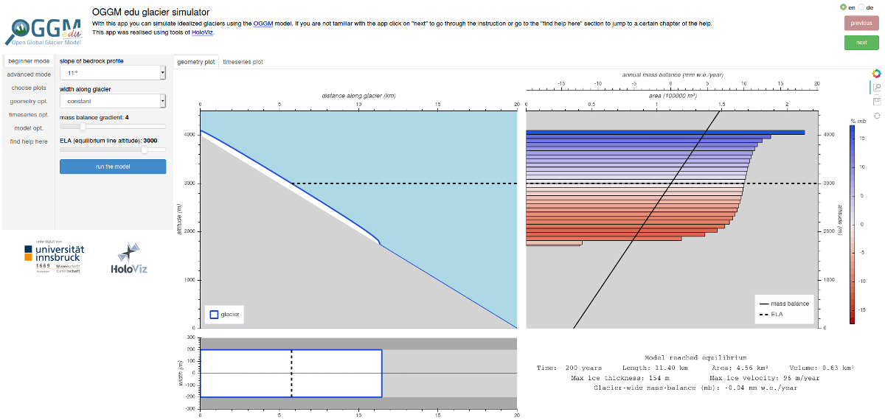

.. _simulator:

Glacier Simulator
=================

The glacier simulator is an **interactive web application** with which
you can learn (and teach) about glacier flow, how glaciers grow and shrink,
what parameters influence their size, and a lot more!

You can start the app by clicking on this link: |badge_bokeh_en|_

.. _badge_bokeh_en: https://bokeh.oggm.org/simulator/app

.. important::

  The glacier simulator app runs a numerical glacier model in the background,
  using computer resources on the cloud. If several people are using the app at
  the same time, the server might become slow or unresponsive. In this case,
  we recommend to use the app
  `on MyBinder <https://mybinder.org/v2/gh/OGGM/glacier_simulator/v1.1?urlpath=panel/app>`_
  or even locally on your own computer (see :ref:`docker-launch-simulator` below).

Getting started with the app
----------------------------

The upper panel in the app is a guided tutorial about the app's functionalities.
You can navigate it with the "Next" and "Previous" buttons, or use the
"Find help here" overview.

Questions to explore with this app
----------------------------------

With this app, you can address many questions, by yourself or in class!
This list will grow in the future (documentation takes time!).

Glacier shape
~~~~~~~~~~~~~

See `antarcticglaciers.org (mass-balance)`_
for an introduction about glacier mass-balance and the ELA, or our
:ref:`glacier_basics` graphics for an illustration.

**In "beginner mode", start by setting the ELA to 3000m a.s.l**, and note
on a piece of paper: the equilibrium volume of the glacier,
its length and maximal thickness. **Now choose the "wider top" glacier shape**
and run the model again. Is the new glacier larger or smaller than before? Why?

..  admonition:: Take home messages
    :class: toggle

    A glacier with a wider top has a larger `accumulation area <https://en.wikipedia.org/wiki/Accumulation_zone>`_.
    It can therefore accumulate more mass (more ice) and flow further down.

Equilibrium Line Altitude (ELA)
~~~~~~~~~~~~~~~~~~~~~~~~~~~~~~~

See `antarcticglaciers.org (mass-balance)`_
for an introduction about glacier mass-balance and the ELA, or our
:ref:`glacier_basics` graphics for an illustration.

We are going to show that the ELA is determinant in shaping glaciers.

**In "beginner mode", start by setting the ELA to 2500m a.s.l**, and note
on a piece of paper: the equilibrium volume of the glacier,
its length and maximal thickness.

**Now change the ELA up to 3500m a.s.l in 200m increments** and, at each
step, note the equilibrium volume of the glacier, its length and maximal thickness.

**Now draw these variables on a graph, as a function of the ELA.**
How does glacier volume change with ELA? Can you explain why?
What about glacier length and thickness? Are these changes linear, or more
complex?

..  admonition:: Take home messages
    :class: toggle

    An example graphic that students could come up with by varying the ELA
    with different shapes:

    .. figure:: _static/simulator_ela_example.png
        :width: 100%

    **The lower the ELA, the larger the equilibrium glacier**. The length,
    volume or maximal thickness are not necessarily linear functions of the
    ELA.

Glacier slope
~~~~~~~~~~~~~

The slope of a glacier bed is one key ingredient which determines glacier flow.
For a introduction, visit `antarcticglaciers.org (glacier-flow)`_.
In short: glaciers flow downslope driven by the gravitational force.
This force can be decomposed into an along-slope component and perpenticular to the slope component (see
`this illustration in wikipedia <https://en.wikipedia.org/wiki/Inclined_plane#/media/File:Free_body1.3.svg>`_).
The along-slope component "pulls" the glacier downwards and the perpendicular component "flattens" the glacier.

**Experiments:**

- *Beginners*: Use beginner mode with standard settings (constant width, mass
  balance gradient of 4 and ELA of 3000) and run the model with all different
  settings for the slope and use the geometry plot for inspection.
  Take notes on a piece of paper of the ice thickness, volume, area and length
  at the end of each model run.
- *Advanced*: Conduct the same experiment as for beginners, but additionally
  switch on the timeseries plot. Also take notes of the velocity and look how
  the parameters change with time in the timeseries plot.

**Questions to answer:**

- *Beginners*: which glaciers are thicker? Steep or flat ones? And why?
- *Advanced*: which glaciers are faster? Steep or flat ones? How and why does
  the velocity change with time?

..  admonition:: Take home messages
    :class: toggle

    - glaciers flow downslope
    - the steeper the slope the thinner the glacier (larger along-slope gravitational force)
    - the flatter the slope the larger the equilibrium velocity. When the glacier
      is thin (has not much mass) the along-slope component is more important.
      When the glacier is getting thicker the perpendicular component is getting
      more weight. This partly explains slower velocities for flatter slopes
      at the start of the model run, and higher velocities when the glacier is
      getting thicker. For steeper slopes the velocities at the start are
      large and so more ice is transported downwards, and the glacier stays
      relatively thin.

.. _antarcticglaciers.org (mass-balance): http://www.antarcticglaciers.org/glacier-processes/introduction-glacier-mass-balance
.. _antarcticglaciers.org (glacier-flow): http://www.antarcticglaciers.org/glacier-processes/glacier-flow-2/glacier-flow

Surging glaciers
~~~~~~~~~~~~~~~~

Some of the world's glaciers experience "surges" during which they flow much faster than usual 
and can advance dramatically. For an introduction see `antarcticglaciers.org (surging-glaciers)`_ ,
or `this video`_ of surging Karakorum glaciers seen from space.
 
We will use the simulator app to explore the characteristics of a surging glacier.

**Experiment:**

Use the "beginner mode" with standard settings (constant width, mass balance gradient of 4 and ELA of 3000) and run the 
model to create a glacier in equilibrium.
This glacier should now experience a surge which lasts for ten years:
Switch into the "advanced mode". Turn on "sliding", i.e. the glacier will "slip" on the 
bedrock, and let the model advance for 10 years. Between surge events long periods of 
quiescence happen: simulate one by advancing your glacier without sliding for 100 years. 
Repeat the surge event and the period of quiescence. Use the timeseries plots and the 
timeseries options to show the maximum velocity as well as the maximum thickness.

**Questions to answer:**

*Beginners:*

During a surge event:

- How much faster is the glacier during a surge in comparison to a "normal" (quiescence) period?
- How much gains the glacier in length? 

After a surge event:

- How can you explain the glacier retreat?

*Advanced:*

- Why is the glacier thinning during a surge?
- How can you explain the opposing behaviours of length and volume during a surge?
- Why is the glacier thickening after the surge?

..  admonition:: Take home messages
    :class: toggle

    - during a surge event: The glacier flows faster and reaches lower in the valley. 
      In the upper parts the accumulation of snow does change, but not much 
      (accumulation is slightly less since the glacier is thinner: a process called mass-balance / elevation feedback).
      At the same time, a much larger area than usual of the glacier is exposed to melt below 
      the ELA. Therefore the glacier thins and looses volume, although it is still advancing.
    - after a surge event: The glacier flow recovers its usual "slow" velocity. The glacier 
      will retreat until it accumulated enough ice to advance again.

**Going further:**

In the Notebook :ref:`notebooks_surging_glaciers` you can use OGGM to simulate surging events in Python yourself.

.. _`antarcticglaciers.org (surging-glaciers)`: http://www.antarcticglaciers.org/glacier-processes/glacier-flow-2/surging-glaciers/
.. _`this video`: http://cdn.antarcticglaciers.org/wp-content/uploads/2012/10/Panmah_and_Choktoi_glaciers_large.gif

Authors
-------

`Patrick Schmitt <https://github.com/pat-schmitt>`_ (main author) and
`Fabien Maussion <https://fabienmaussion.info/>`_.

Source code
-----------

Code and data are on `GitHub <https://github.com/OGGM/glacier_simulator>`_, BSD licensed.

.. _docker-launch-simulator:

Launching from Docker
---------------------

This application can keep a single processor quite busy when running. Fortunately,
you can also start the app locally, which will make it
faster and less dependent on an internet connection (although you still
need one to download the app and display the logos).

To start the app locally, all you'll need is to
have `Docker <https://www.docker.com/>`_ installed on your computer.
From there, run this command into a terminal:

    docker run -e BOKEH_ALLOW_WS_ORIGIN=127.0.0.1 -p 8080:8080 oggm/bokeh:20200406 git+https://github.com/OGGM/glacier_simulator.git app.ipynb

Once running, you should be able to start the app in your browser at this
address: `http://127.0.0.1:8080/ <http://127.0.0.1:8080/>`_.
